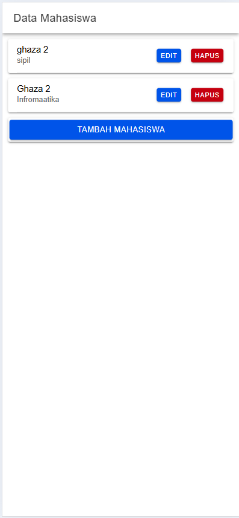

Nama : Ghaza Indra Pratama

NIM  : H1D022073

## Create




```
tambahMahasiswa() {
    if (this.nama != '' && this.jurusan != '') {
      let data = {
        nama: this.nama,
        jurusan: this.jurusan,
      };
      this.api.tambah(data, 'tambah.php').subscribe({
        next: (hasil: any) => {
          this.resetModal();
          console.log('berhasil tambah mahasiswa');
          this.getMahasiswa();
          this.modalTambah = false;
          this.modal.dismiss();
        },
        error: (err: any) => {
          console.log('gagal tambah mahasiswa');
        },
      });
    } else {
      console.log('gagal tambah mahasiswa karena masih ada data yg kosong');
    }
  }
```

### penjelasan create
```
if (this.nama != '' && this.jurusan != '')
```
Baris ini memeriksa apakah kedua atribut nama dan jurusan telah diisi (tidak kosong). Jika ada yang kosong, fungsi tidak akan melanjutkan ke proses penambahan data dan hanya menampilkan pesan kesalahan.

Jika kondisi ini tidak terpenuhi, fungsi akan langsung keluar, dan kode berikut dijalankan:
```
console.log('gagal tambah mahasiswa karena masih ada data yg kosong');
```

Jika input tidak kosong, fungsi membuat objek data yang berisi nama dan jurusan untuk dikirim ke server.
```
let data = {
    nama: this.nama,
    jurusan: this.jurusan,
};
```

Data yang telah disiapkan dikirim ke API dengan memanggil this.api.tambah() yang menerima data dan endpoint 'tambah.php'. Fungsi ini mengembalikan Observable, yang memungkinkan respons dari server ditangani menggunakan subscribe.
```
this.api.tambah(data, 'tambah.php').subscribe({
        next: (hasil: any) => {
          this.resetModal();
          console.log('berhasil tambah mahasiswa');
          this.getMahasiswa();
          this.modalTambah = false;
          this.modal.dismiss();
        },
        error: (err: any) => {
          console.log('gagal tambah mahasiswa');
        },
      });
```

Jika Pengiriman Data Berhasil:

Fungsi next dijalankan yang berisi
- this.resetModal(); – Mereset input di modal sehingga siap digunakan kembali.
- console.log('berhasil tambah mahasiswa'); – Menampilkan pesan sukses di konsol.
- this.getMahasiswa(); – Memuat ulang daftar mahasiswa untuk memperbarui tampilan.
- this.modalTambah = false; dan this.modal.dismiss(); – Menyembunyikan dan menutup modal setelah data berhasil ditambahkan.

```
next: (hasil: any) => {
    this.resetModal();
    console.log('berhasil tambah mahasiswa');
    this.getMahasiswa();
    this.modalTambah = false;
    this.modal.dismiss();
},
```

Jika Pengiriman Data Gagal

Fungsi error dijalankan
```
error: (err: any) => {
    console.log('gagal tambah mahasiswa');
},
```


