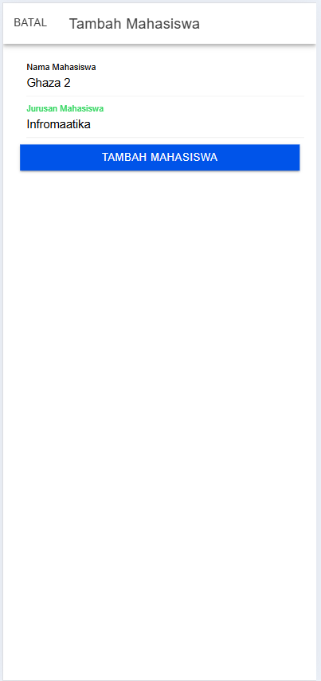

Nama : Ghaza Indra Pratama

NIM  : H1D022073

## Create




```
tambahMahasiswa() {
    if (this.nama != '' && this.jurusan != '') {
      let data = {
        nama: this.nama,
        jurusan: this.jurusan,
      };
      this.api.tambah(data, 'tambah.php').subscribe({
        next: (hasil: any) => {
          this.resetModal();
          console.log('berhasil tambah mahasiswa');
          this.getMahasiswa();
          this.modalTambah = false;
          this.modal.dismiss();
        },
        error: (err: any) => {
          console.log('gagal tambah mahasiswa');
        },
      });
    } else {
      console.log('gagal tambah mahasiswa karena masih ada data yg kosong');
    }
  }
```

### penjelasan create
```
if (this.nama != '' && this.jurusan != '')
```
Baris ini memeriksa apakah kedua atribut nama dan jurusan telah diisi (tidak kosong). Jika ada yang kosong, fungsi tidak akan melanjutkan ke proses penambahan data dan hanya menampilkan pesan kesalahan.

Jika kondisi ini tidak terpenuhi, fungsi akan langsung keluar, dan kode berikut dijalankan:
```
console.log('gagal tambah mahasiswa karena masih ada data yg kosong');
```

Jika input tidak kosong, fungsi membuat objek data yang berisi nama dan jurusan untuk dikirim ke server.
```
let data = {
    nama: this.nama,
    jurusan: this.jurusan,
};
```

Data yang telah disiapkan dikirim ke API dengan memanggil this.api.tambah() yang menerima data dan endpoint 'tambah.php'. Fungsi ini mengembalikan Observable, yang memungkinkan respons dari server ditangani menggunakan subscribe.
```
this.api.tambah(data, 'tambah.php').subscribe({
        next: (hasil: any) => {
          this.resetModal();
          console.log('berhasil tambah mahasiswa');
          this.getMahasiswa();
          this.modalTambah = false;
          this.modal.dismiss();
        },
        error: (err: any) => {
          console.log('gagal tambah mahasiswa');
        },
      });
```

Jika Pengiriman Data Berhasil:

Fungsi next dijalankan yang berisi
- this.resetModal(); – Mereset input di modal sehingga siap digunakan kembali.
- console.log('berhasil tambah mahasiswa'); – Menampilkan pesan sukses di konsol.
- this.getMahasiswa(); – Memuat ulang daftar mahasiswa untuk memperbarui tampilan.
- this.modalTambah = false; dan this.modal.dismiss(); – Menyembunyikan dan menutup modal setelah data berhasil ditambahkan.

```
next: (hasil: any) => {
    this.resetModal();
    console.log('berhasil tambah mahasiswa');
    this.getMahasiswa();
    this.modalTambah = false;
    this.modal.dismiss();
},
```

Jika Pengiriman Data Gagal

Fungsi error dijalankan
```
error: (err: any) => {
    console.log('gagal tambah mahasiswa');
},
```
## Read


```
  getMahasiswa() {
    this.api.tampil('tampil.php').subscribe({
      next: (res: any) => {
        console.log('sukses', res);
        this.dataMahasiswa = res;
      },
      error: (err: any) => {
        console.log(err);
      },
    });
  }
```

### Penjelasan Read
Fungsi getMahasiswa() bertujuan untuk mengambil data mahasiswa dari server menggunakan endpoint API 'tampil.php'.
```
this.api.tampil('tampil.php').subscribe({
      next: (res: any) => {
        console.log('sukses', res);
        this.dataMahasiswa = res;
      },
      error: (err: any) => {
        console.log(err);
      },
    });
```

Setelah API mengirimkan respons, subscribe() digunakan untuk menangani hasil yang diterima. Fungsi ini menangani dua kemungkinan: respons sukses (next) dan kesalahan (error).

Jika Respons Sukses:
- Blok next dijalankan jika server memberikan respons yang berhasil. Dalam hal ini, respons dari server (res) berisi data mahasiswa yang diinginkan.
- Data tersebut kemudian disimpan dalam variabel this.dataMahasiswa.
```
next: (res: any) => {
    console.log('sukses', res);
    this.dataMahasiswa = res;
},
```

Jika Respons Gagal:
Blok error dijalankan jika terjadi kesalahan dalam mengambil data, seperti kegagalan koneksi atau masalah pada API.
```
error: (err: any) => {
    console.log(err);
},
```

## edit


```
editMahasiswa() {
    let data = {
      id: this.id,
      nama: this.nama,
      jurusan: this.jurusan,
    };
    this.api.edit(data, 'edit.php').subscribe({
      next: (hasil: any) => {
        console.log(hasil);
        this.resetModal();
        this.getMahasiswa();
        console.log('berhasil edit Mahasiswa');
        this.modalEdit = false;
        this.modal.dismiss();
      },
      error: (err: any) => {
        console.log('gagal edit Mahasiswa');
      },
    });
  }
```

### penjelasan edit
Fungsi editMahasiswa() mulai dengan menyiapkan objek data yang berisi informasi mahasiswa yang akan diubah
```
let data = {
    id: this.id,
    nama: this.nama,
    jurusan: this.jurusan,
};
```
Setelah objek data siap, fungsi this.api.edit(data, 'edit.php') dipanggil untuk mengirim data ini ke server melalui endpoint edit.php.
```
this.api.edit(data, 'edit.php').subscribe({
      next: (hasil: any) => {
        console.log(hasil);
        this.resetModal();
        this.getMahasiswa();
        console.log('berhasil edit Mahasiswa');
        this.modalEdit = false;
        this.modal.dismiss();
      },
      error: (err: any) => {
        console.log('gagal edit Mahasiswa');
      },
    });
```

Subscribe() berfungsi untuk menunggu dan menangani hasil respons dari API. Ini terdiri dari dua kemungkinan: next jika respons berhasil, dan error jika terjadi kesalahan.

Jika Edit Berhasil (next):

blok next dijalankan, dengan objek hasil yang berisi respons dari server.
```
next: (hasil: any) => {
    console.log(hasil);
    this.resetModal();
    this.getMahasiswa();
    console.log('berhasil edit Mahasiswa');
    this.modalEdit = false;
    this.modal.dismiss();
},
```
- this.getMahasiswa(); – Memuat ulang daftar mahasiswa dari server, memastikan tampilan diperbarui sesuai dengan data terbaru.

Jika Edit Gagal (error):

Jika terjadi kesalahan saat mengirim data atau server mengalami masalah, blok error akan dijalankan.
```
error: (err: any) => {
    console.log('gagal edit Mahasiswa');
},
```

Pesan "gagal edit Mahasiswa" ditampilkan di konsol untuk memberi tahu pengembang bahwa proses edit tidak berhasil.

## delete


```
  hapusMahasiswa(id: any) {
    this.api.hapus(id, 'hapus.php?id=').subscribe({
      next: (res: any) => {
        console.log('sukses', res);
        this.getMahasiswa();
        console.log('berhasil hapus data');
      },
      error: (error: any) => {
        console.log('gagal');
      },
    });
  }
```

### penjelasan delete
Fungsi hapusMahasiswa() menerima parameter id, yang merupakan ID mahasiswa yang ingin dihapus.

Kemudian, metode this.api.hapus(id, 'hapus.php?id=') dipanggil untuk mengirim permintaan penghapusan data mahasiswa ke server. Endpoint 'hapus.php?id=' digunakan bersama dengan ID mahasiswa yang diteruskan untuk menentukan mahasiswa yang akan dihapus.

```
this.api.hapus(id, 'hapus.php?id=').subscribe({
      next: (res: any) => {
        console.log('sukses', res);
        this.getMahasiswa();
        console.log('berhasil hapus data');
      },
      error: (error: any) => {
        console.log('gagal');
      },
    });
```

Setelah permintaan penghapusan dikirim, fungsi subscribe() digunakan untuk menangani respons dari server. Dua blok utama dalam subscribe adalah next untuk respons yang berhasil, dan error untuk menangani kegagalan.

Jika Penghapusan Berhasil (next):

blok next akan dijalankan.

```
next: (res: any) => {
    console.log('sukses', res);
    this.getMahasiswa();
    console.log('berhasil hapus data');
},
```

- this.getMahasiswa(); – Memanggil metode getMahasiswa() untuk memperbarui daftar mahasiswa, sehingga data yang baru saja dihapus tidak lagi muncul pada tampilan aplikasi.

Jika Penghapusan Gagal (error):

blok error akan dijalankan.

```
error: (error: any) => {
    console.log('gagal');
},
```

- Di sini, hanya pesan "gagal" yang ditampilkan di konsol untuk memberi tahu bahwa penghapusan data tidak berhasil.
